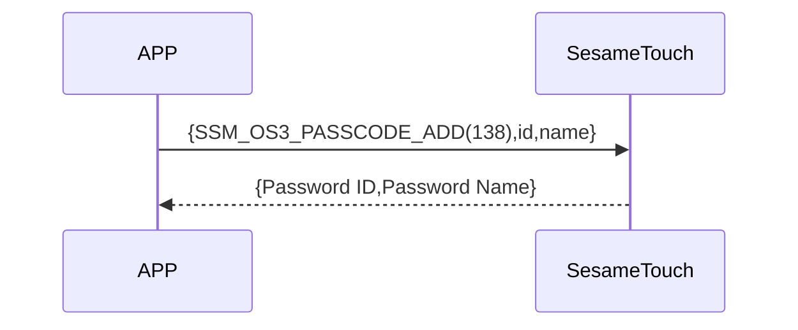

# 140 密码添加

手机通过蓝牙向 ssm_touch 发送添加密码的指令。  
发送的数据包含密码 和名称。添加成功后设备将返回响应。(名字超過 20Bytes，只取前 20Bytes)

## 序列图



## 手机发送的数据格式

| 字节范围  | 内容                    |
| --------- | ----------------------- |
| [0]       | 密码头数据（KB_HEADER） |
| [1]       | 密码类型（KB_TYPE）     |
| [2]       | 数字密码 长度（字节数） |
| [3 ～ 18] | 数字密码的（字节数组）  |
| [19]      | 名称长度（字节数）      |
| [20-39]   | 名称（字节数组）        |

item code : SSM_OS3_PASSCODE_ADD (138)

---

### 枚举定义 和 数据结构

```c
typedef enum {
    KB_DATA_EMPTY = 0xFF,
    KB_DATA_USED = 0xF0,
    KB_DATA_DELETED = 0x00,
} KB_HEADER;

typedef enum {
    KB_TYPE_LOCAL = 0x00,
} KB_TYPE;

typedef struct {
    uint8_t kb_header;  // 0xFF:空；0xF0:已使用；0x00:已删除
    uint8_t kb_type;  // 数字密码的类型，用于确定是否需要云端验证。0x00:本地密码；0x01:云端密码(是通过IoT添加的密码)
    uint8_t kb_id_lg;  // 数字密码的长度
    uint8_t kb_id[16];  // 数字密码的内容
    uint8_t kb_name_lg;  // 名称的长度
    uint8_t kb_name[KB_NAME_LENGTH];  // 名称的内容
} card_note_t;  ///total 40 字节
```

## Payload 结构说明

添加密码的 payload 数据结构如下：

| 字节偏移                                                          | 名称       | 类型      | 说明                         |
| ----------------------------------------------------------------- | ---------- | --------- | ---------------------------- |
|                                                                   | kb_header  | uint8     | 密码头数据（参见 KB_HEADER） |
|                                                                   | kb_type    | uint8     | 密码类型（参见 KB_TYPE）     |
| 0                                                                 | kb_id_lg   | uint8     | 数字密码 长度（单位：字节）  |
| Password ID Len ~ 1                                               | kb_id      | uint8[16] | 数字密码 字节数组            |
| Password ID Len + 1                                               | kb_name_lg | uint8     | 名称长度（单位：字节）       |
| (Password Name Len + Password ID Len + 1) ~ (Password ID Len + 2) | kb_name    | uint8[20] | 名称字符串的 UTF-8 字节数组  |

### payload 字节示例

假设密码 为 `123456`，名称为 `"Home"`：

| 字节偏移 | 内容（十六进制）                                              | 说明                            |
| -------- | ------------------------------------------------------------- | ------------------------------- |
| 0        | `0xF0`                                                        | `KB_DATA_USED`（已使用）        |
| 1        | `0x00`                                                        | `KB_TYPE_LOCAL`（本地密码）     |
| 2        | `0x06`                                                        | ID 长度 = 6 字节（"123456"）    |
| 3\~18    | `01 02 03 04 05 06 00 00 00 00 00 00 00 00 00 00`             | `"123456"` ＋ 补零至 16 |
| 19       | `0x04`                                                        | 名称长度 = 4 字节                   |
| 20\~39   | `48 6F 6D 65 00 00 00 00 00 00 00 00 00 00 00 00 00 00 00 00` | `"Home"` 的 UTF-8 ＋补零至 20   |

---

## 设备响应格式（来自 ssm_touch）

| Byte | 2            | 1         | 0        |
| ---- | ------------ | --------- | -------- |
| Data | res          | item_code | type     |
| 说明 | 命令处理状态 | 指令编号  | 推送类型 |

- type : `SSM2_OP_CODE_RESPONSE`（0x07）
- item code : `SSM_OS3_PASSCODE_ADD`（138）
- res：`CMD_RESULT_SUCCESS`（0x00）或失败状态码

### 失败状态码

```C
typedef enum {
    CMD_RESULT_SUCCESS,
    CMD_RESULT_INVALID_FORMAT,
    CMD_RESULT_NOT_SUPPORTED,
    CMD_RESULT_STORAGE_FAIL,
    CMD_RESULT_INVALID_SIG,
    CMD_RESULT_NOT_FOUND,
    CMD_RESULT_UNKNOWN,
    CMD_RESULT_BUSY,
    CMD_RESULT_INVALID_PARAM,
    CMD_RESULT_INVALID_ACTION,
} cmd_result_e;
```

## iOS、Android、ESP32 範例

### Android 实现示例

```kotlin
internal fun ByteArray.padEnd(length: Int, value: Byte = 0x00.toByte()): ByteArray {
    if (this.size >= length) return this
    return this + ByteArray(length - this.size) { value }
}

override fun keyBoardPassCodeAdd(id: ByteArray, name: String, result: CHResult<CHEmpty>) {
        sendCommandSafely(
            SesameOS3Payload(
                SesameItemCode.SSM_OS3_PASSCODE_ADD.value,
                byteArrayOf(0xF0/*KB_DATA_USED*/.toByte()) + byteArrayOf(0x00/*KB_TYPE_LOCAL*/.toByte()) + byteArrayOf(id.size.toByte()) + id.padEnd(16, 0x00.toByte()) + byteArrayOf(name.toByteArray().size.toByte()) + name.toByteArray().padEnd(16, 0x00.toByte())
            ), result
        ) { res ->
            result.invoke(Result.success(CHResultState.CHResultStateBLE(CHEmpty())))
        }
    }

```

### esp32 实现示例

```c
// todo
```

### iOS 实现示例

```swift
TODO()

```
