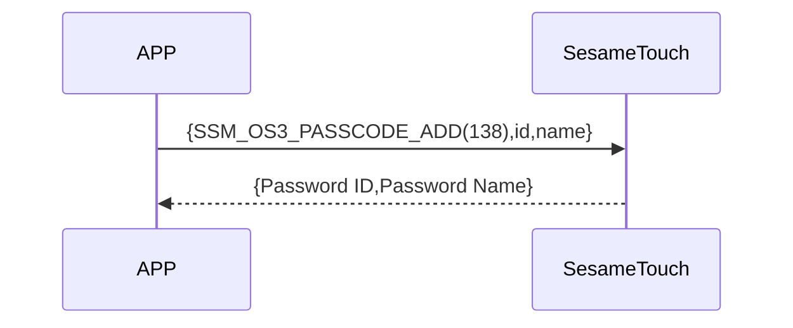

# 140 Password Add

The smartphone sends a command via Bluetooth to ssm_touch to add a password.
The data sent includes the password, and password name. (If the name exceeds 20 bytes, only the first 20 bytes will be used.)
Upon successful addition, the device returns a response.

## Sequence Diagram



## Mobile Sent Data

| Byte  | Content                    |
| --------- | ----------------------- |
| [0]       | Password header（KB_HEADER） |
| [1]       | Password Type（KB_TYPE）     |
| [2]       | Password length（in bytes） |
| [3 ～ 18] | Password（byte array）  |
| [19]      | Name length（in bytes）      |
| [20-39]   | Password name（byte array）        |

item code : SSM_OS3_PASSCODE_ADD (138)

---

### Enumerations and Data Structure

```c
typedef enum {
    KB_DATA_EMPTY = 0xFF,
    KB_DATA_USED = 0xF0,
    KB_DATA_DELETED = 0x00,
} KB_HEADER;

typedef enum {
    KB_TYPE_LOCAL = 0x00,
} KB_TYPE;

typedef struct {
    uint8_t kb_header;  // EMPTY 0xFF， USED 0xF0， DELETED 0x00
    uint8_t kb_type;  // Type of Password（0x00: local, 0x01: cloud）
    uint8_t kb_id_lg;  // Length of Password
    uint8_t kb_id[16];  // Content of Password
    uint8_t kb_name_lg;  // Length of name
    uint8_t kb_name[KB_NAME_LENGTH];  // Content of name
} card_note_t;  ///total 40 bytes
```

## Payload Format

The payload data structure for password addition is as follows：

| Byte Offset            | Name       | Type      | Description       |
| ------------------------- | ---------- | --------- | ---------------------------- |
|                            | kb_header  | uint8     | Password header（see KB_HEADER） |
|                    　　　　 | kb_type    | uint8     | Password Type（see KB_TYPE）     |
| 0                   　　　 | kb_id_lg   | uint8     | Length of password (in bytes)  |
| Password ID Len ~ 1       | kb_id      | uint8[16] | Password as byte array              |
| Password ID Len + 1       | kb_name_lg | uint8     | Length of name (in bytes)          |
| (Password Name Len + Password ID Len + 1) ~ (Password ID Len + 2) | kb_name    | uint8[20] | UTF-8 encoded name byte array  |

### Example Payload Bytes

Assuming Password is  `123456` and name is  `"Home"`:

| Byte Offset | Content (Hex)         　　　　　　                      　    | Description                     |
| -------- | ------------------------------------------------------------- | ------------------------------- |
| 0        | `0xF0`                                                        | `KB_DATA_USED`（used）        |
| 1        | `0x00`                                                        | `KB_TYPE_LOCAL`（local）|
| 2        | `0x06`                                                        | Password length = 6 bytes（"123456"）  |
| 3\~18    | `01 02 03 04 05 06 00 00 00 00 00 00 00 00 00 00`             | `"123456"` ＋ padding (total 16 bytes) |
| 19       | `0x04`                                                        | Name length = 4 bytes                |
| 20\~39   | `48 6F 6D 65 00 00 00 00 00 00 00 00 00 00 00 00 00 00 00 00` | `"Home"` in UTF-8 + 0 padding (total 20 bytes) |

---

## ssm_touch Return Content

| Byte | 2            | 1         | 0        |
| ---- | ------------ | --------- | -------- |
| Data | res          | Command code | Response type     |
| Description | Command result | Current command identifier  | Response type constant |

- type : `SSM2_OP_CODE_RESPONSE`（0x07）
- item code : `SSM_OS3_PASSCODE_ADD`（138）
- res：`CMD_RESULT_SUCCESS`（0x00）or failure status code

### Failure Status Codes

```C
typedef enum {
    CMD_RESULT_SUCCESS,
    CMD_RESULT_INVALID_FORMAT,
    CMD_RESULT_NOT_SUPPORTED,
    CMD_RESULT_STORAGE_FAIL,
    CMD_RESULT_INVALID_SIG,
    CMD_RESULT_NOT_FOUND,
    CMD_RESULT_UNKNOWN,
    CMD_RESULT_BUSY,
    CMD_RESULT_INVALID_PARAM,
    CMD_RESULT_INVALID_ACTION,
} cmd_result_e;
```

## iOS、Android、ESP32 Example

###　Android　Example

```kotlin
internal fun ByteArray.padEnd(length: Int, value: Byte = 0x00.toByte()): ByteArray {
    if (this.size >= length) return this
    return this + ByteArray(length - this.size) { value }
}

override fun keyBoardPassCodeAdd(id: ByteArray, name: String, result: CHResult<CHEmpty>) {
        sendCommandSafely(
            SesameOS3Payload(
                SesameItemCode.SSM_OS3_PASSCODE_ADD.value,
                byteArrayOf(0xF0/*KB_DATA_USED*/.toByte()) + byteArrayOf(0x00/*KB_TYPE_LOCAL*/.toByte()) + byteArrayOf(id.size.toByte()) + id.padEnd(16, 0x00.toByte()) + byteArrayOf(name.toByteArray().size.toByte()) + name.toByteArray().padEnd(16, 0x00.toByte())
            ), result
        ) { res ->
            result.invoke(Result.success(CHResultState.CHResultStateBLE(CHEmpty())))
        }
    }

```

### esp32　Example

```c
// todo
```

### iOS　Example

```swift
TODO()

```