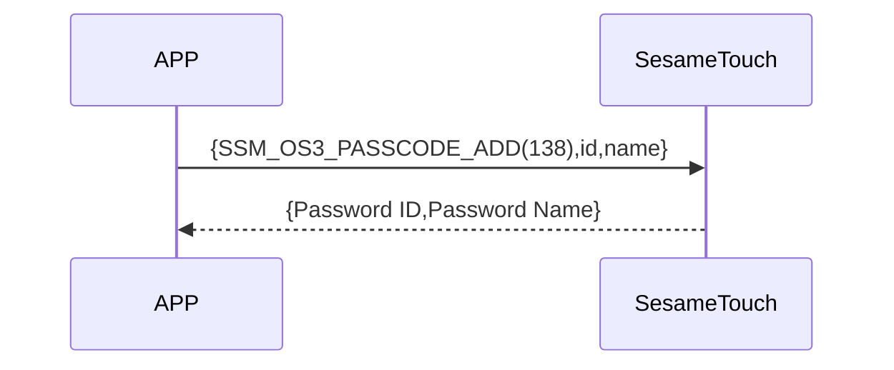

# 140 パスワード追加

スマートフォンは Bluetooth を通じて ssm_touch に追加のコマンドを送信します。
送信されるデータには、パスワード、パスワード名が含まれます。（名前が20バイトを超える場合は先頭20バイトのみ使用されます）。
追加が成功すると、デバイスから応答が返されます。

## シーケンス図



## 携帯電話から送信するデータ

| Byte  | 内容                    |
| --------- | ----------------------- |
| [0]       | パスワードヘッダー（KB_HEADER） |
| [1]       | パスワードタイプ（KB_TYPE）     |
| [2]       | パスワードの長さ（バイト数） |
| [3 ～ 18] | パスワード（バイト配列）  |
| [19]      | パスワード名の長さ（バイト数）      |
| [20-39]   | パスワード名（バイト配列）        |

item code : SSM_OS3_PASSCODE_ADD (138)

---

### 列挙定義とデータ構造

```c
typedef enum {
    KB_DATA_EMPTY = 0xFF,
    KB_DATA_USED = 0xF0,
    KB_DATA_DELETED = 0x00,
} KB_HEADER;

typedef enum {
    KB_TYPE_LOCAL = 0x00,
} KB_TYPE;

typedef struct {
    uint8_t kb_header;  // 0xFF:空；0xF0:使⽤中；0x00:削除済み
    uint8_t kb_type;  // 暗証番号のタイプ（0x00: ローカルで発⾏, 0x01: クラウド経由で発⾏）
    uint8_t kb_id_lg;  // パスワードの長さ
    uint8_t kb_id[16];  // パスワードの内容
    uint8_t kb_name_lg;  // 名称の長さ
    uint8_t kb_name[KB_NAME_LENGTH];  // 名称の内容
} card_note_t;  ///total 40 バイト
```

## Payload 構造

パスワード追加時に送信される Payload の構造は以下の通りです：

| バイトオフセット            | 項目名       | 型      | 説明       |
| ------------------------- | ---------- | --------- | ---------------------------- |
|                            | kb_header  | uint8     | パスワードヘッダー（KB_HEADER参照） |
|                    　　　　 | kb_type    | uint8     | パスワードタイプ（KB_TYPE参照）     |
| 0                   　　　 | kb_id_lg   | uint8     | バスワードの長さ（単位：バイト）  |
| Password ID Len ~ 1       | kb_id      | uint8[16] | パスワードのバイト配列            |
| Password ID Len + 1       | kb_name_lg | uint8     | 名称の長さ（単位：バイト）       |
| (Password Name Len + Password ID Len + 1) ~ (Password ID Len + 2) | kb_name    | uint8[20] | 名前のUTF-8 バイト列  |

### Payload のバイト例

例：パスワード `123456`、名称 `"Home"`の場合

| バイト位置 | 内容（16進数）            　　　　　　                      　    | 説明                     |
| -------- | ------------------------------------------------------------- | ------------------------------- |
| 0        | `0xF0`                                                        | `KB_DATA_USED`（使用中）        |
| 1        | `0x00`                                                        | `KB_TYPE_LOCAL`（ローカルパスワード）|
| 2        | `0x06`                                                        | パスワードの長さ = 6 バイト（"123456"）    |
| 3\~18    | `01 02 03 04 05 06 00 00 00 00 00 00 00 00 00 00`             | `"123456"` ＋ でパディング（全16バイト） |
| 19       | `0x04`                                                        | 名称の長さ = 4                    |
| 20\~39   | `48 6F 6D 65 00 00 00 00 00 00 00 00 00 00 00 00 00 00 00 00` | `"Home"` のUTF-8 ＋ 0 でパディング（全20バイト） |

---

## ssm_touch からの応答内容

| Byte | 2            | 1         | 0        |
| ---- | ------------ | --------- | -------- |
| Data | res          | コマンド番号 | 応答タイプ     |
| 説明 | コマンド処理結果 | 現在の指令番号  | 応答種別定数 |

- type : `SSM2_OP_CODE_RESPONSE`（0x07）
- item code : `SSM_OS3_PASSCODE_ADD`（138）
- res：`CMD_RESULT_SUCCESS`（0x00）または失敗コード

### 失敗コード定義

```C
typedef enum {
    CMD_RESULT_SUCCESS,
    CMD_RESULT_INVALID_FORMAT,
    CMD_RESULT_NOT_SUPPORTED,
    CMD_RESULT_STORAGE_FAIL,
    CMD_RESULT_INVALID_SIG,
    CMD_RESULT_NOT_FOUND,
    CMD_RESULT_UNKNOWN,
    CMD_RESULT_BUSY,
    CMD_RESULT_INVALID_PARAM,
    CMD_RESULT_INVALID_ACTION,
} cmd_result_e;
```

## iOS、Android、ESP32 の例

###　Androidの例

```kotlin
internal fun ByteArray.padEnd(length: Int, value: Byte = 0x00.toByte()): ByteArray {
    if (this.size >= length) return this
    return this + ByteArray(length - this.size) { value }
}

override fun keyBoardPassCodeAdd(id: ByteArray, name: String, result: CHResult<CHEmpty>) {
        sendCommandSafely(
            SesameOS3Payload(
                SesameItemCode.SSM_OS3_PASSCODE_ADD.value,
                byteArrayOf(0xF0/*KB_DATA_USED*/.toByte()) + byteArrayOf(0x00/*KB_TYPE_LOCAL*/.toByte()) + byteArrayOf(id.size.toByte()) + id.padEnd(16, 0x00.toByte()) + byteArrayOf(name.toByteArray().size.toByte()) + name.toByteArray().padEnd(16, 0x00.toByte())
            ), result
        ) { res ->
            result.invoke(Result.success(CHResultState.CHResultStateBLE(CHEmpty())))
        }
    }

```

### esp32の例

```c
// todo
```

### iOSの例

```swift
TODO()

```
