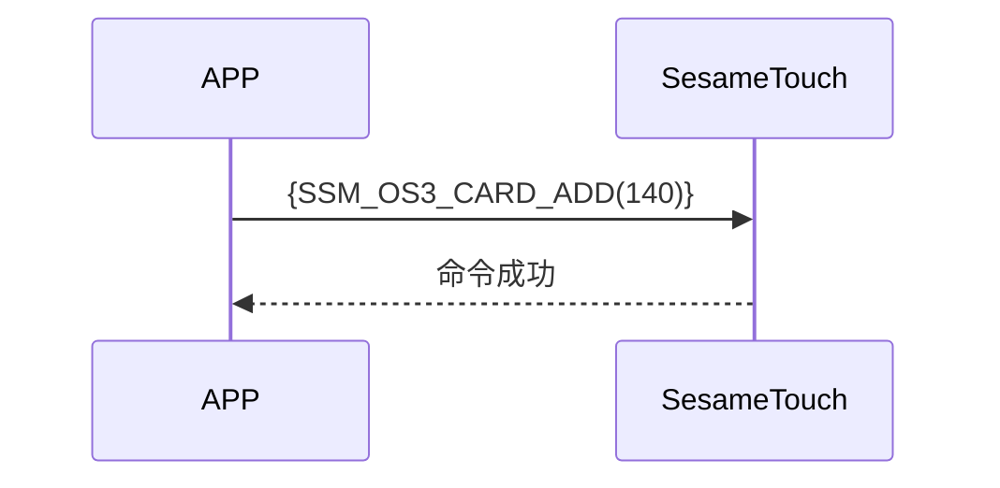

# 140 卡片添加

手机通过蓝牙向 ssm_touch 发送添加卡片的指令。  
发送的数据包含卡片类型、卡片 ID 和名称。添加成功后设备将返回响应。

## 序列图



## 手机发送的数据格式

| 字节范围  | 内容                      |
| --------- | ------------------------- |
| [0]       | 卡片头数据（CARD_HEADER） |
| [1]       | 卡片类型（CARD_TYPE）     |
| [2]       | ID 长度（字节数）         |
| [3 ～ 18] | 卡片 ID（字节数组）       |
| [19]      | 名称长度（字节数）        |
| [20-39]   | 名称（字节数组）          |

item code : SSM_OS3_CARD_ADD (140)

---

### 枚举定义 和 数据结构

```c
typedef enum {
    CARD_DATA_EMPTY = 0xFF,
    CARD_DATA_USED = 0xF0,
    CARD_DATA_DELETED = 0x00,
} CARD_HEADER;

typedef enum {
  CARD_TYPE_OTHER = 0x00,
  CARD_TYPE_SUICA = 0x01,
  CARD_TYPE_PASMO = 0x02,
  CARD_TYPE_CLOUD_BASE = 0x80, // 云端卡, 需要云端验证
} CARD_TYPE;

typedef struct {
    uint8_t card_header;  // EMPTY 0xFF， USED 0xF0， DELETED 0x00
    uint8_t card_type;  // 米非卡 费力卡
    uint8_t card_id_lg;  // id 长度
    uint8_t card_id[16];
    uint8_t card_name_lg;  // 名称 长度
    uint8_t card_name[20];
} card_note_t;  ///total 40
```

## Payload 结构说明（payload）

添加卡片的 payload 数据结构如下：

| 字节偏移 | 名称        | 类型      | 说明                        |
| -------- | ----------- | --------- | --------------------------- |
| 0        | card_header | uint8     | 卡片 ID 长度（字节数）      |
| 1        | card_type   | uint8     | 卡片类型（参见 CARD_TYPE）  |
| 2        | id_length   | uint8     | 卡片 ID 长度（单位：字节）  |
| 3~(N)    | card_id     | uint8[16] | 卡片 ID 字节数组            |
| N+1      | name_length | uint8     | 名称长度（单位：字节）      |
| N+2~(M)  | card_name   | uint8[20] | 名称字符串的 UTF-8 字节数组 |

### payload 字节示例

假设卡片类型为 SUICA（0x01），ID 为 `"12345678"`，名称为 `"Home"`：

| 字节偏移 | 内容（十六进制）                                                | 说明             |
| -------- | --------------------------------------------------------------- | ---------------- |
| 0        | `0xF0`                                                          | CARD_DATA_USED   |
| 1        | `0x01`                                                          | CARD_TYPE_SUICA  |
| 2        | `0x08`                                                          | ID 长度 = 8 字节 |
| 3~18     | `0x01 02 03 04 05 06 07 08 00 00 00 00 00 00 00 00`             | `"12345678"`     |
| 19       | `0x04`                                                          | 名称长度 = 4     |
| 20~39    | `0x48 6F 6D 65 00 00 00 00 00 00 00 00 00 00 00 00 00 00 00 00` | `"Home"`         |

---

## 设备响应格式（来自 ssm_touch）

| Byte | 2            | 1            | 0            |
| ---- | ------------ | ------------ | ------------ |
| Data | res          | 指令代码     | 响应类型     |
| 说明 | 命令处理状态 | 当前指令编号 | 响应类型常量 |

- type : `SSM2_OP_CODE_RESPONSE`（0x07）
- item code : `SSM_OS3_CARD_ADD`（140）
- res：`CMD_RESULT_SUCCESS`（0x00）或失败状态码

### 失败状态码

```C
typedef enum {
    CMD_RESULT_SUCCESS,
    CMD_RESULT_INVALID_FORMAT,
    CMD_RESULT_NOT_SUPPORTED,
    CMD_RESULT_STORAGE_FAIL,
    CMD_RESULT_INVALID_SIG,
    CMD_RESULT_NOT_FOUND,
    CMD_RESULT_UNKNOWN,
    CMD_RESULT_BUSY,
    CMD_RESULT_INVALID_PARAM,
    CMD_RESULT_INVALID_ACTION,
} cmd_result_e;
```

## iOS、Android、ESP32 範例

### Android 实现示例

```kotlin
internal fun ByteArray.padEnd(length: Int, value: Byte = 0x00.toByte()): ByteArray {
    if (this.size >= length) return this
    return this + ByteArray(length - this.size) { value }
}

override fun cardAdd(id: ByteArray, name: String, result: CHResult<CHEmpty>) {
    sendCommandSafely(
        SesameOS3Payload(
            SesameItemCode.SSM_OS3_CARD_ADD.value,
            byteArrayOf(0xF0/*CARD_DATA_USED*/.toByte())+ byteArrayOf(0x80/*CARD_TYPE_CLOUD_BASE*/.toByte()) + byteArrayOf(id.size.toByte()) + id.padEnd(16, 0x00.toByte()) + byteArrayOf(name.toByteArray().size.toByte()) + name.toByteArray().padEnd(16, 0x00.toByte())
        ), result
    ) { res ->
        result.invoke(Result.success(CHResultState.CHResultStateBLE(CHEmpty())))
    }
}
```

### esp32 实现示例

```c
// todo
```

### iOS 实现示例

```swift
TODO()

```
