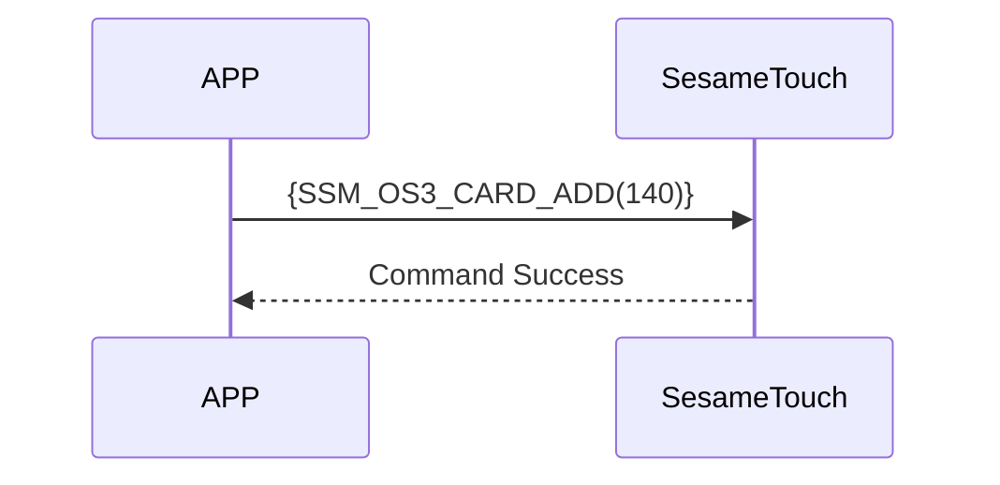

# 140 Card Add

The smartphone sends a command via Bluetooth to ssm_touch to add a card.
The data sent includes the card type, card ID, and card name.
Upon successful addition, the device returns a response.

## Sequence Diagram



## Mobile Sent Data

| Byte Range  | Content                      |
| --------- | ------------------------- |
| [0]       | Card header (CARD_HEADER) |
| [1]       | Card type (CARD_TYPE)     |
| [2]       | ID length (in bytes)       |
| [3 ～ 18] | Card ID (byte array)       |
| [19]      | Name length (in bytes)  |
| [20-39]   | Card name (byte array)      |

item code : SSM_OS3_CARD_ADD (140)

---

### Enumerations and Data Structure

```c
typedef enum {
    CARD_DATA_EMPTY = 0xFF,
    CARD_DATA_USED = 0xF0,
    CARD_DATA_DELETED = 0x00,
} CARD_HEADER;

typedef enum {
  CARD_TYPE_OTHER = 0x00,
  CARD_TYPE_SUICA = 0x01,
  CARD_TYPE_PASMO = 0x02,
  CARD_TYPE_CLOUD_BASE = 0x80, // Cloud-based card, requires cloud validation
} CARD_TYPE;

typedef struct {
    uint8_t card_header;  // EMPTY 0xFF， USED 0xF0， DELETED 0x00
    uint8_t card_type;  // MIFARE, FeliCa, etc.
    uint8_t card_id_lg;  // Length of card ID
    uint8_t card_id[16];
    uint8_t card_name_lg;  // Length of name
    uint8_t card_name[20];
} card_note_t;  ///total 40 bytes
```

## Payload Format

The payload data structure for card addition is as follows：

| Byte Offset | Name        | Type      | Description                        |
| -------- | ----------- | --------- | --------------------------- |
| 0        | card_header | uint8     | Card header      |
| 1        | card_type   | uint8     | Card type (see CARD_TYPE)  |
| 2        | id_length   | uint8     | Length of card ID (in bytes)  |
| 3~(N)    | card_id     | uint8[16] | Card ID as byte array         |
| N+1      | name_length | uint8     | Length of name (in bytes)      |
| N+2~(M)  | card_name   | uint8[20] | UTF-8 encoded name byte array |

### Example Payload Bytes

Assuming card type is SUICA（0x01）, ID is `"12345678"`, and name is `"Home"`：

| Byte Offset | Content (Hex)                             |Description         |
| -------- | --------------------------------------------------------------- | ---------------- |
| 0        | `0xF0`                                                          | CARD_DATA_USED   |
| 1        | `0x01`                                                          | CARD_TYPE_SUICA  |
| 2        | `0x08`                                                          | ID length = 8 bytes |
| 3~18     | `0x01 02 03 04 05 06 07 08 00 00 00 00 00 00 00 00`             | `"12345678"`     |
| 19       | `0x04`                                                          | Name length = 4 bytes    |
| 20~39    | `0x48 6F 6D 65 00 00 00 00 00 00 00 00 00 00 00 00 00 00 00 00` | `"Home"`         |

---

## ssm_touch Return Content

| Byte Offset | 2            | 1            | 0            |
| ---- | ------------ | ------------ | ------------ |
| Filed | res          | Command code	     | Response type	     |
| Description | Command result| Current command identifier | Response type constant |

- type : `SSM2_OP_CODE_RESPONSE`（0x07）
- item code : `SSM_OS3_CARD_ADD`（140）
- res：`CMD_RESULT_SUCCESS`（0x00）or failure status code

### Failure Status Codes

```C
typedef enum {
    CMD_RESULT_SUCCESS,
    CMD_RESULT_INVALID_FORMAT,
    CMD_RESULT_NOT_SUPPORTED,
    CMD_RESULT_STORAGE_FAIL,
    CMD_RESULT_INVALID_SIG,
    CMD_RESULT_NOT_FOUND,
    CMD_RESULT_UNKNOWN,
    CMD_RESULT_BUSY,
    CMD_RESULT_INVALID_PARAM,
    CMD_RESULT_INVALID_ACTION,
} cmd_result_e;
```

## iOS,Android,ESP32 Example

### Android Example

```kotlin
internal fun ByteArray.padEnd(length: Int, value: Byte = 0x00.toByte()): ByteArray {
    if (this.size >= length) return this
    return this + ByteArray(length - this.size) { value }
}

override fun cardAdd(id: ByteArray, name: String, result: CHResult<CHEmpty>) {
    sendCommandSafely(
        SesameOS3Payload(
            SesameItemCode.SSM_OS3_CARD_ADD.value,
            byteArrayOf(0xF0/*CARD_DATA_USED*/.toByte())+ byteArrayOf(0x80/*CARD_TYPE_CLOUD_BASE*/.toByte()) + byteArrayOf(id.size.toByte()) + id.padEnd(16, 0x00.toByte()) + byteArrayOf(name.toByteArray().size.toByte()) + name.toByteArray().padEnd(16, 0x00.toByte())
        ), result
    ) { res ->
        result.invoke(Result.success(CHResultState.CHResultStateBLE(CHEmpty())))
    }
}
```

### esp32 Example

```c
// todo
```

### iOS Example

```swift
TODO()

```
