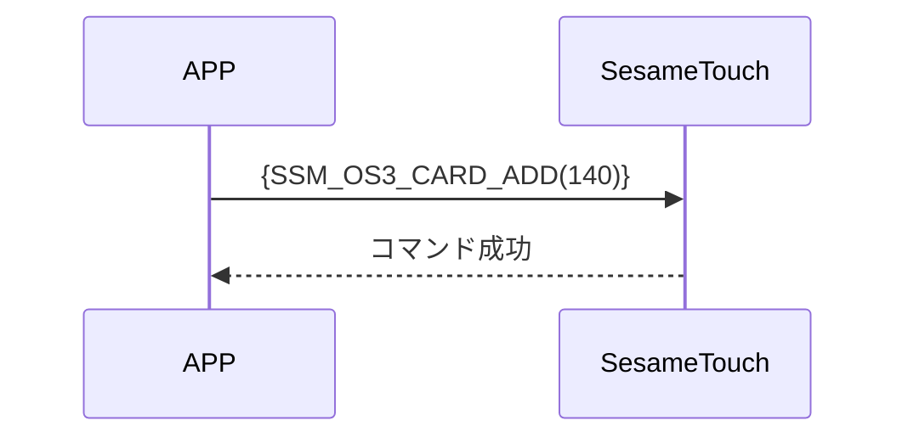

# 140 カード追加

スマートフォンは Bluetooth を通じて ssm_touch にカード追加のコマンドを送信します。
送信されるデータには、カードタイプ、カード ID、カード名が含まれます。
追加が成功すると、デバイスから応答が返されます。


## シーケンス図



## 携帯電話から送信するデータ

| Byte  　　| 内容                      |
| --------- | ------------------------- |
| [0]       | カードヘッダー（CARD_HEADER） |
| [1]       | カードタイプ（CARD_TYPE）     |
| [2]       | IDの長さ（バイト数）         |
| [3 ～ 18] | カードID（バイト配列）       |
| [19]      | 名称の長さ（バイト数）        |
| [20-39]   | 名称（バイト配列）          |

item code : SSM_OS3_CARD_ADD (140)

---

### 列挙定義とデータ構造

```c
typedef enum {
    CARD_DATA_EMPTY = 0xFF,
    CARD_DATA_USED = 0xF0,
    CARD_DATA_DELETED = 0x00,
} CARD_HEADER;

typedef enum {
  CARD_TYPE_OTHER = 0x00,
  CARD_TYPE_SUICA = 0x01,
  CARD_TYPE_PASMO = 0x02,
  CARD_TYPE_CLOUD_BASE = 0x80, // クラウド、クラウド検証が必要
} CARD_TYPE;

typedef struct {
    uint8_t card_header;  // EMPTY 0xFF， USED 0xF0， DELETED 0x00
    uint8_t card_type;  // MIFARE、FeliCa など
    uint8_t card_id_lg;  // idの長さ
    uint8_t card_id[16];
    uint8_t card_name_lg;  // 名称の長さ
    uint8_t card_name[20];
} card_note_t;  ///total 40 バイト
```

## Payload 構造

カード追加時に送信される Payload の構造は以下の通りです：

| バイトオフセット | 項目名        | 型      | 説明                       |
| -------- | ----------- | --------- | --------------------------- |
| 0        | card_header | uint8     | カードヘッダー      |
| 1        | card_type   | uint8     | カードタイプ（CARD_TYPE参照）  |
| 2        | id_length   | uint8     | カードIDの長さ（单位：バイト）  |
| 3~(N)    | card_id     | uint8[16] | カードIDのバイト配列         |
| N+1      | name_length | uint8     | 名称の長さ（单位：バイト）      |
| N+2~(M)  | card_name   | uint8[20] | 名前のUTF-8 バイト列 |

### Payload のバイト例

例：カードタイプ = SUICA (0x01)、ID = `"12345678"`、名称 = `"Home"` の場合

| バイト位置 | 内容（16進数）                                                | 説明          |
| -------- | --------------------------------------------------------------- | ---------------- |
| 0        | `0xF0`                                                          | CARD_DATA_USED   |
| 1        | `0x01`                                                          | CARD_TYPE_SUICA  |
| 2        | `0x08`                                                          | ID長さ = 8 バイト |
| 3~18     | `0x01 02 03 04 05 06 07 08 00 00 00 00 00 00 00 00`             | `"12345678"`     |
| 19       | `0x04`                                                          | 名称の長さ = 4バイト     |
| 20~39    | `0x48 6F 6D 65 00 00 00 00 00 00 00 00 00 00 00 00 00 00 00 00` | `"Home"`         |

---

## ssm_touch からの応答内容

| Byte | 2            | 1            | 0            |
| ---- | ------------ | ------------ | ------------ |
| Data | res          | コマンド番号     | 応答タイプ     |
| 説明 | コマンド処理結果 | 現在の指令番号 | 応答種別定数 |

- type : `SSM2_OP_CODE_RESPONSE`（0x07）
- item code : `SSM_OS3_CARD_ADD`（140）
- res：`CMD_RESULT_SUCCESS`（0x00）または失敗コード

### 失敗コード定義

```C
typedef enum {
    CMD_RESULT_SUCCESS,
    CMD_RESULT_INVALID_FORMAT,
    CMD_RESULT_NOT_SUPPORTED,
    CMD_RESULT_STORAGE_FAIL,
    CMD_RESULT_INVALID_SIG,
    CMD_RESULT_NOT_FOUND,
    CMD_RESULT_UNKNOWN,
    CMD_RESULT_BUSY,
    CMD_RESULT_INVALID_PARAM,
    CMD_RESULT_INVALID_ACTION,
} cmd_result_e;
```

## iOS、Android、ESP32 の例

### Androidの例

```kotlin
internal fun ByteArray.padEnd(length: Int, value: Byte = 0x00.toByte()): ByteArray {
    if (this.size >= length) return this
    return this + ByteArray(length - this.size) { value }
}

override fun cardAdd(id: ByteArray, name: String, result: CHResult<CHEmpty>) {
    sendCommandSafely(
        SesameOS3Payload(
            SesameItemCode.SSM_OS3_CARD_ADD.value,
            byteArrayOf(0xF0/*CARD_DATA_USED*/.toByte())+ byteArrayOf(0x80/*CARD_TYPE_CLOUD_BASE*/.toByte()) + byteArrayOf(id.size.toByte()) + id.padEnd(16, 0x00.toByte()) + byteArrayOf(name.toByteArray().size.toByte()) + name.toByteArray().padEnd(16, 0x00.toByte())
        ), result
    ) { res ->
        result.invoke(Result.success(CHResultState.CHResultStateBLE(CHEmpty())))
    }
}
```

### esp32の例

```c
// todo
```

### iOSの例

```swift
TODO()

```
