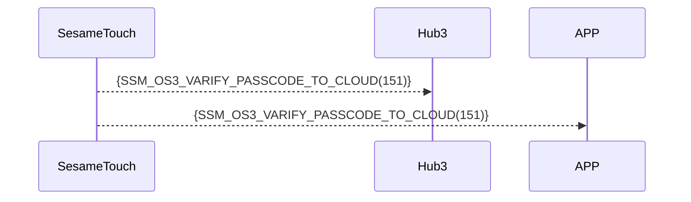

# 151 Password Verification via Cloud

When the device detects an “unregistered”, it immediately forwards the information via Bluetooth to Hub3/APP. Hub3/APP determines the validity, or forwards it to the cloud for verification.

Based on the result, Hub3/APP or the cloud directly sends a command to the lock bound to this SesameTouch to perform unlocking.

## Sequence Diagram



## Mobile Sent Data

| Byte |     N ~ 2      |     1     |    0     |
| ---- | :------------: | :-------: | :------: |
| Data |    payload     | item_code |   type   |
| Description | Data sent to APP | Command ID  | Push Type |

type : SSM2_OP_CODE_PUBLISH (0x08)

item code : SSM_OS3_VARIFY_PASSCODE_TO_CLOUD (151)

payload : See the table below

---

### Enumerations and Data Structure

```c
typedef enum {
    KB_TYPE_LOCAL = 0x00,
} KB_TYPE;

typedef struct {
    uint8_t kb_header;  // 0xFF: empty; 0xF0: in use; 0x00: deleted
    uint8_t kb_type;  // Numeric password type
    uint8_t kb_id_lg;  // Length of the numeric password
    uint8_t kb_id[16];  // Numeric password content
    uint8_t kb_name_lg;  // Name length
    uint8_t kb_name[KB_NAME_LENGTH];  // Name content
} card_note_t;  ///total 40 bytes
```

## Payload Format

The payload data structure for password addition is as follows：

| Byte Offset                                     | Name       | Type              | Description                        |
| -------------------------------------------- | ---------- | ----------------- | --------------------------- |
| 0                                            | kb_type    | uint8             | Password Type（see KB_TYPE））    |
| 1                                            | kb_id_lg   | uint8             | Length of password (in bytes) |
| 2 ~ (kb_id_lg + 1)                           | kb_id      | uint8[kb_id_lg]   | Password as byte array           |
| kb_id_lg + 2                                 | kb_name_lg | uint8             | Length of name (in bytes)      |
| (kb_id_lg + 3) ~ (kb_name_lg + kb_id_lg + 2) | kb_name    | uint8[kb_name_lg] | UTF-8 encoded name byte array |

### Example Payload Bytes

Assuming Password is  `123456` and name is  `"Home"`:

| Byte Offset	 | Content (Hex)     | Description                         |
| -------- | ------------------- | ---------------------------- |
| 0        | `0x00`              | `KB_TYPE_LOCAL`（local）  |
| 1        | `0x06`              | Password length = 6 bytes（"123456"） |
| 2 ~ 7    | `01 02 03 04 05 06` | `"123456"`                   |
| 8        | `0x04`              | Name length = 4 bytes        |
| 9 ~ 12   | `48 6F 6D 65`       | `"Home"` in UTF-8         |

## iOS、Android、ESP32 Example

- Forward to the cloud for password verification, or
- Verify the password in APP/ESP32
- If correct, send an unlock command to the lock bound to this SesameTouch

### Android Example

```kotlin
TODO()

```

### esp32 Example

```c
// todo
```

### iOS Example

```swift
TODO()

```
