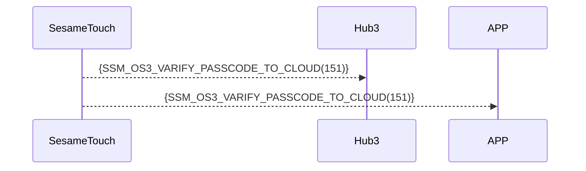

# 151 パスワードクラウド検証

デバイスが「未登録」の数字パスワード入力を検出した場合、即座に Bluetooth 経由で Hub3/APP に転送します。Hub3/APP が判定、またはクラウドに転送して判定を行います。

判定結果に基づき、Hub3/APP またはクラウドがこの SesameTouch に紐づけられたロックに直接コマンドを送り、解錠を実行します。

## シーケンス図



## 携帯電話から送信するデータ

| Byte |     N ~ 2      |     1     |    0     |
| ---- | :------------: | :-------: | :------: |
| Data |    payload     | item_code |   type   |
| 説明 | スマホに送るデータ | コマンド番号  | プッシュ種別 |

type : SSM2_OP_CODE_PUBLISH (0x08)

item code : SSM_OS3_VARIFY_PASSCODE_TO_CLOUD (151)

payload : 以下の表を参照

---

### 列挙定義とデータ構造

```c
typedef enum {
    KB_TYPE_LOCAL = 0x00,
} KB_TYPE;

typedef struct {
    uint8_t kb_header;  // 0xFF:空；0xF0:使用済み；0x00:削除済み
    uint8_t kb_type;  // 数字パスワードのタイプ
    uint8_t kb_id_lg;  // 数字パスワードの長さ
    uint8_t kb_id[16];  // 数字パスワードの内容
    uint8_t kb_name_lg;  // 名前の長さ
    uint8_t kb_name[KB_NAME_LENGTH];  // 名前の内容
} card_note_t;  ///合計 40 バイト
```

## Payload 構造

パスワード追加時に送信される Payload の構造は以下の通りです：

| バイトオフセット                                     | 項目名       | 型              | 説明                        |
| -------------------------------------------- | ---------- | ----------------- | --------------------------- |
| 0                                            | kb_type    | uint8             | パスワードタイプ（KB_TYPE参照））    |
| 1                                            | kb_id_lg   | uint8             | 数字パスワードの長さ（バイト） |
| 2 ~ (kb_id_lg + 1)                           | kb_id      | uint8[kb_id_lg]   | 数字パスワードのバイト配列           |
| kb_id_lg + 2                                 | kb_name_lg | uint8             | 名前の長さ（バイト）      |
| (kb_id_lg + 3) ~ (kb_name_lg + kb_id_lg + 2) | kb_name    | uint8[kb_name_lg] | 名前文字列（UTF-8バイト配列） |

### Payload のバイト例

例：パスワード `123456`、名称 `"Home"`の場合

| バイト位置 | 内容（16進数）    | 説明                         |
| -------- | ------------------- | ---------------------------- |
| 0        | `0x00`              | `KB_TYPE_LOCAL`（ローカル）  |
| 1        | `0x06`              | パスワードの長さ = 6 バイト（"123456"） |
| 2 ~ 7    | `01 02 03 04 05 06` | `"123456"`                   |
| 8        | `0x04`              | 名称の長さ = 4            |
| 9 ~ 12   | `48 6F 6D 65`       | `"Home"` の UTF-8            |

## iOS、Android、ESP32 の例

- クラウドに転送してパスワードの正否を確認、または
- APP/ESP32 でパスワードの正否を確認
- 正しければ、この SesameTouch に紐づけられたロックに解錠コマンドを送信

### Androidの例

```kotlin
TODO()

```

### esp32の例

```c
// todo
```

### iOSの例

```swift
TODO()

```
