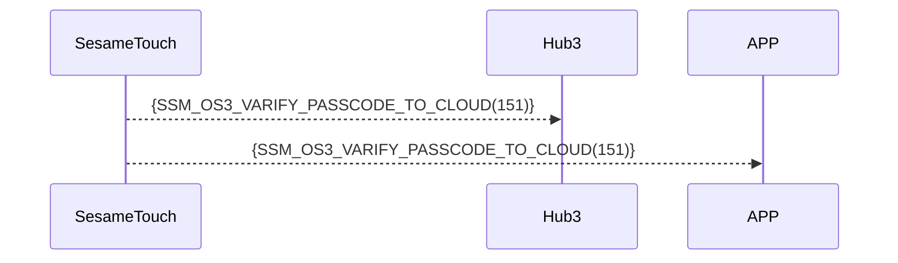

# 151 密码云端验证

当设备检测到 "未注册的" 或者 "类型是 KB_TYPE_CLOUD 的" 数字密码 输入时，立即通过蓝牙将信息转发至 Hub3/APP，由 Hub3/APP 判定或者转发至云端进行判定。

根据判定结果，Hub3/APP 或者 云端 直接发命令给这台 SesameTouch 绑定的锁， 执行开锁。

## 序列图



## ssm_touch 推送內容

| Byte |     N ~ 2      |     1     |    0     |
| ---- | :------------: | :-------: | :------: |
| Data |    payload     | item_code |   type   |
| 說明 | 送給手機的資料 | 指令編號  | 推送類型 |

type : SSM2_OP_CODE_PUBLISH (0x08)

item code : SSM_OS3_VARIFY_PASSCODE_TO_CLOUD (151)

payload : 詳見以下表格

---

### 枚举定义 和 数据结构

```c
typedef enum {
    KB_TYPE_LOCAL = 0x00,
    KB_TYPE_CLOUD = 0x01,
} KB_TYPE;

typedef struct {
    uint8_t kb_header;  // 0xFF:空；0xF0:已使用；0x00:已删除
    uint8_t kb_type;  // 数字密码的类型，用于确定是否需要云端验证。0x00:本地密码；0x01:云端密码(是通过IoT添加的密码)
    uint8_t kb_id_lg;  // 数字密码的长度
    uint8_t kb_id[16];  // 数字密码的内容
    uint8_t kb_name_lg;  // 名称的长度
    uint8_t kb_name[KB_NAME_LENGTH];  // 名称的内容
} card_note_t;  ///total 40 字节
```

## Payload 结构说明

payload 数据结构如下：

| 字节偏移                                     | 名称       | 类型              | 说明                        |
| -------------------------------------------- | ---------- | ----------------- | --------------------------- |
| 0                                            | kb_type    | uint8             | 密码类型（参见 KB_TYPE）    |
| 1                                            | kb_id_lg   | uint8             | 数字密码 长度（单位：字节） |
| 2 ~ (kb_id_lg + 1)                           | kb_id      | uint8[kb_id_lg]   | 数字密码 字节数组           |
| kb_id_lg + 2                                 | kb_name_lg | uint8             | 名称长度（单位：字节）      |
| (kb_id_lg + 3) ~ (kb_name_lg + kb_id_lg + 2) | kb_name    | uint8[kb_name_lg] | 名称字符串的 UTF-8 字节数组 |

### payload 字节示例

假设密码 为 `123456`，名称为 `"Home"`：

| 字节偏移 | 内容（十六进制）    | 说明                         |
| -------- | ------------------- | ---------------------------- |
| 0        | `0x00`              | `KB_TYPE_LOCAL`（本地密码）  |
| 1        | `0x06`              | ID 长度 = 6 字节（"123456"） |
| 2 ~ 7    | `01 02 03 04 05 06` | `"123456"`                   |
| 8        | `0x04`              | 名称长度 = 4 字节            |
| 9 ~ 12   | `48 6F 6D 65`       | `"Home"` 的 UTF-8            |

## iOS、Android、ESP32 範例

- 转发至云端确认此密码是否正确，或者
- 在 APP/ESP32 确认此密码是否正确
- 若正确， 发送 开锁命令给 这台 SesameTouch 绑定的锁。

### Android 实现示例

```kotlin
TODO()

```

### esp32 实现示例

```c
// todo
```

### iOS 实现示例

```swift
TODO()

```
