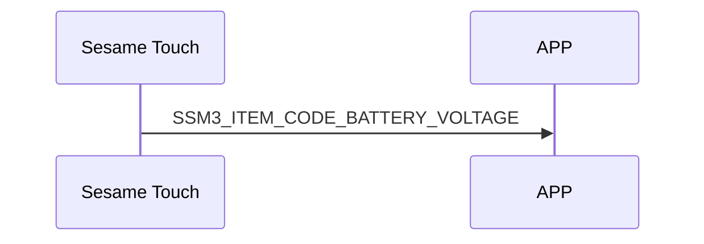

# 202 Battery Voltage 电池电压

battery_data 电池电压数据。

## battery_data 的結構內容:

### Sesame Touch 的 battery_data 数据结构

```c
#pragma pack(1)
typedef struct
{
    uint16_t light_load_voltage;
    uint16_t heavy_load_voltage;
} battery_data_t;
#pragma pack()
```

為了防止客戶端頻繁跟 sesame device 請求，只能由 sesame device 主動發送。

## 手機與 ssm5 傳輸 mechStatus 互動循序圖



## Sesame Touch 推送內容

| Byte |     N ~ 2      |     1     |    0     |
| ---- | :------------: | :-------: | :------: |
| Data |    payload     | item_code |   type   |
| 說明 | 送給手機的資料 | 指令編號  | 推送類型 |

type : SSM2_OP_CODE_PUBLISH (0x08)

item code : SSM3_ITEM_CODE_BATTERY_VOLTAGE (202)

payload : 詳見以下表格

### payload

| Byte |    3 ~ 0     |
| ---- | :----------: |
| Data | battery_data |
