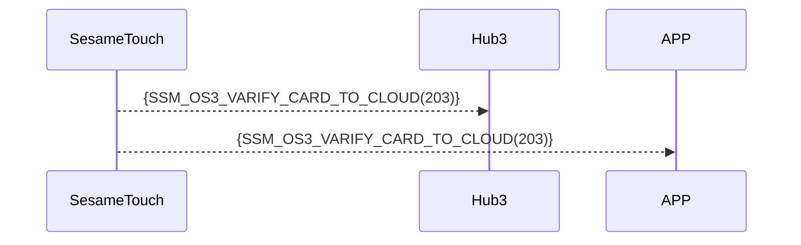

# 203 Card Verification to Cloud

When the device detects an **unregistered NFC card**, it immediately transfers the information via Bluetooth to Hub3/APP.  
Hub3/APP performs the verification, or forwards it to the cloud for verification.

Based on the verification result, Hub3/APP or the cloud sends a direct command to the lock linked with this SesameTouch to perform unlocking.

## Sequence Diagram



## ssm_touch Push Content

| Byte |     N ~ 2      |     1     |    0     |
| ---- | :------------: | :-------: | :------: |
| Data |    payload     | item_code |   type   |
| Description | Data to mobile | Command ID  | Push type |

type : SSM2_OP_CODE_PUBLISH (0x08)

item code : SSM_OS3_VARIFY_CARD_TO_CLOUD (203)

payload : see the table below

---

### Enumerations and Data Structure

```c

typedef enum {
  CARD_TYPE_OTHER = 0x00,
  CARD_TYPE_SUICA = 0x01,
  CARD_TYPE_PASMO = 0x02,
} CARD_TYPE;

typedef struct {
    uint8_t card_header;  // EMPTY 0xFF， USED 0xF0， DELETED 0x00
    uint8_t card_type;  // MIFARE，FeliCa，etc.
    uint8_t card_id_lg;  // Length of card ID
    uint8_t card_id[16];
    uint8_t card_name_lg;  // Length of card ID
    uint8_t card_name[20];
} card_note_t;  /// total 40 bytes
```

## Payload Format

The payload data structure for card addition is as follows：

| Byte Offset	                 | Name        | Type       | Description     |
| ----------------------------------------------- | ----------- | ------------------ | --------------------------- |
| 0                                               | card_type   | uint8              | Card type (see CARD_TYPE)  |
| 1                                               | id_length   | uint8              | Length of card ID (in bytes)  |
| 2 ~ (id_length + 1)                             | card_id     | uint8[id_length]   | Card ID as byte array            |
| id_length + 2                                   | name_length | uint8              | Length of name (in bytes)      |
| (id_length + 3) ~ (id_length + name_length + 2) | card_name   | uint8[name_length] | UTF-8 encoded name byte array |

### Example Payload Bytes

Assuming card type is SUICA（0x01）, ID is "12345678", and name is "Home"：

| Byte Offset	 | Content (Hex)         | Description             |
| -------- | --------------------------- | ---------------- |
| 0        | `0x01`                      | CARD_TYPE_SUICA  |
| 1        | `0x08`                      | ID length = 8 bytes |
| 2~9      | `0x01 02 03 04 05 06 07 08` | `"12345678"`     |
| 10       | `0x04`                      | Name length = 4 bytes     |
| 11~14    | `0x48 6F 6D 65`             | `"Home"`         |

---

## Device Response Format (from Hub3)

| Byte Offset	 | 2            | 1            | 0            |
| ---- | ------------ | ------------ | ------------ |
| Data | res          | Command code     | Response type     |
| Description | Command result	 | Current command identifier | Response type constant |

- type : `SSM2_OP_CODE_RESPONSE`（0x07）
- item code : `SSM_OS3_VARIFY_CARD_TO_CLOUD`（203）
- res：`CMD_RESULT_SUCCESS`（0x00）or failure status code

## iOS、Android、ESP32 Example

### Android Example

```kotlin
TODO()
```

### esp32 Example

```c
// todo
```

### iOS Example

```swift
TODO()

```
