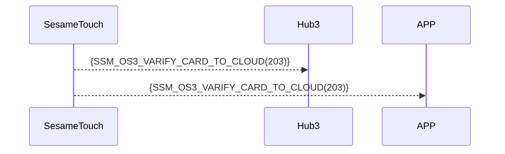

# 203 カードクラウド検証

デバイスが「未登録」の NFC カードを検出した場合、即座に Bluetooth 経由で Hub3/APP に転送します。Hub3/APP が判定、またはクラウドに転送して判定を行います。

判定結果に基づき、Hub3/APP またはクラウドがこの SesameTouch に紐づけられたロックに直接コマンドを送り、解錠を実行します。

## シーケンス図



## ssm_touch プッシュ内容

| Byte |     N ~ 2      |     1     |    0     |
| ---- | :------------: | :-------: | :------: |
| Data |    payload     | item_code |   type   |
| 説明 | スマホに送るデータ | コマンド番号  | プッシュ種別 |

type : SSM2_OP_CODE_PUBLISH (0x08)

item code : SSM_OS3_VARIFY_CARD_TO_CLOUD (203)

payload : 以下の表を参照

---

### 列挙定義とデータ構造

```c

typedef enum {
  CARD_TYPE_OTHER = 0x00,
  CARD_TYPE_SUICA = 0x01,
  CARD_TYPE_PASMO = 0x02,
} CARD_TYPE;

typedef struct {
    uint8_t card_header;  // EMPTY 0xFF， USED 0xF0， DELETED 0x00
    uint8_t card_type;  // MIFARE、FeliCa など
    uint8_t card_id_lg;  // IDの長さ
    uint8_t card_id[16];
    uint8_t card_name_lg;  // 名前の長さ
    uint8_t card_name[20];
} card_note_t;  ///合計 40 バイト
```

## Payload 構造

カード追加時に送信される Payload の構造は以下の通りです：

| バイトオフセット	                 | 項目名        | 型               | 説明                   |
| ----------------------------------------------- | ----------- | ------------------ | --------------------------- |
| 0                                               | card_type   | uint8              | カードタイプ（CARD_TYPE参照）  |
| 1                                               | id_length   | uint8              | カードIDの長さ（单位：バイト）  |
| 2 ~ (id_length + 1)                             | card_id     | uint8[id_length]   | カードIDのバイト配列            |
| id_length + 2                                   | name_length | uint8              | 名称の長さ（单位：バイト）      |
| (id_length + 3) ~ (id_length + name_length + 2) | card_name   | uint8[name_length] | 名前のUTF-8 バイト列 |

### Payload のバイト例

例：カードタイプ = SUICA (0x01)、ID = "12345678"、名称 = "Home" の場合

| バイト位置 | 内容（16進法）            | 説明             |
| -------- | --------------------------- | ---------------- |
| 0        | `0x01`                      | CARD_TYPE_SUICA  |
| 1        | `0x08`                      | ID長さ = 8 バイト |
| 2~9      | `0x01 02 03 04 05 06 07 08` | `"12345678"`     |
| 10       | `0x04`                      | 名称の長さ = 4バイト     |
| 11~14    | `0x48 6F 6D 65`             | `"Home"`         |

---

## デバイス応答フォーマット（Hub3 から）

| Byte | 2            | 1            | 0            |
| ---- | ------------ | ------------ | ------------ |
| Data | res          | コマンド番号     | 応答タイプ     |
| 説明 | コマンド処理結果 | 現在の指令番号 | 応答種別定数 |

- type : `SSM2_OP_CODE_RESPONSE`（0x07）
- item code : `SSM_OS3_VARIFY_CARD_TO_CLOUD`（203）
- res：`CMD_RESULT_SUCCESS`（0x00）または失敗コード

## iOS、Android、ESP32 の例

### Android の例

```kotlin
TODO()
```

### esp32 の例

```c
// todo
```

### iOS の例

```swift
TODO()

```
