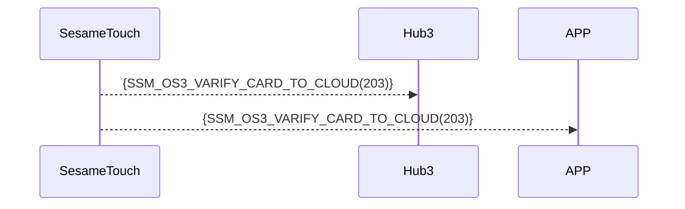

# 203 卡片云端验证

当设备检测到 "未注册的" 或者 "卡片类型大于 CARD_TYPE_CLOUD_BASE" 的 NFC 卡刷卡时，立即通过蓝牙将信息转发至 Hub3/APP，由 Hub3/APP 判定 或者 转发至云端进行判定。

根据判定结果，Hub3/APP 或者 云端 直接发命令给这台 SesameTouch 绑定的锁， 执行开锁。

## 序列图



## ssm_touch 推送內容

| Byte |     N ~ 2      |     1     |    0     |
| ---- | :------------: | :-------: | :------: |
| Data |    payload     | item_code |   type   |
| 說明 | 送給手機的資料 | 指令編號  | 推送類型 |

type : SSM2_OP_CODE_PUBLISH (0x08)

item code : SSM_OS3_VARIFY_CARD_TO_CLOUD (203)

payload : 詳見以下表格

---

### 枚举定义 和 数据结构

```c

typedef enum {
  CARD_TYPE_OTHER = 0x00,
  CARD_TYPE_SUICA = 0x01,
  CARD_TYPE_PASMO = 0x02,
} CARD_TYPE;

typedef struct {
    uint8_t card_header;  // EMPTY 0xFF， USED 0xF0， DELETED 0x00
    uint8_t card_type;  // 米非卡 费力卡
    uint8_t card_id_lg;  // id 长度
    uint8_t card_id[16];
    uint8_t card_name_lg;  // 名称 长度
    uint8_t card_name[20];
} card_note_t;  ///total 40 字节
```

## Payload 结构说明

payload 数据结构如下：

| 字节偏移                                        | 名称        | 类型               | 说明                        |
| ----------------------------------------------- | ----------- | ------------------ | --------------------------- |
| 0                                               | card_type   | uint8              | 卡片类型（参见 CARD_TYPE）  |
| 1                                               | id_length   | uint8              | 卡片 ID 长度（单位：字节）  |
| 2 ~ (id_length + 1)                             | card_id     | uint8[id_length]   | 卡片 ID 字节数组            |
| id_length + 2                                   | name_length | uint8              | 名称长度（单位：字节）      |
| (id_length + 3) ~ (id_length + name_length + 2) | card_name   | uint8[name_length] | 名称字符串的 UTF-8 字节数组 |

### payload 字节示例

假设卡片类型为 SUICA（0x01），ID 为 `"12345678"`，名称为 `"Home"`：

| 字节偏移 | 内容（十六进制）            | 说明             |
| -------- | --------------------------- | ---------------- |
| 0        | `0x01`                      | CARD_TYPE_SUICA  |
| 1        | `0x08`                      | ID 长度 = 8 字节 |
| 2~9      | `0x01 02 03 04 05 06 07 08` | `"12345678"`     |
| 10       | `0x04`                      | 名称长度 = 4     |
| 11~14    | `0x48 6F 6D 65`             | `"Home"`         |

---

## 设备响应格式（来自 hub3）

| Byte | 2            | 1            | 0            |
| ---- | ------------ | ------------ | ------------ |
| Data | res          | 指令代码     | 响应类型     |
| 说明 | 命令处理状态 | 当前指令编号 | 响应类型常量 |

- type : `SSM2_OP_CODE_RESPONSE`（0x07）
- item code : `SSM_OS3_VARIFY_CARD_TO_CLOUD`（203）
- res：`CMD_RESULT_SUCCESS`（0x00）或失败状态码

## iOS、Android、ESP32 範例

### Android 实现示例

```kotlin
TODO()
```

### esp32 实现示例

```c
// todo
```

### iOS 实现示例

```swift
TODO()

```
