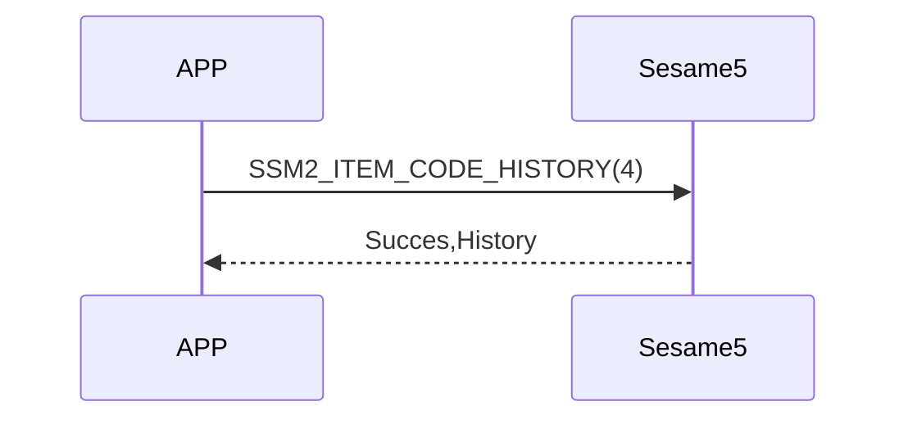

# 4 History

When a smartphone sends a history request command to Sesame5, the device returns **the oldest history record stored in Flash**.  
If you need to delete that record, you must send a **delete command** after reading it.  
(Just reading does not delete it)

<!-- The Sesame5 broadcast includes a flag indicating whether there is a history tag that needs to be read. See the advertising field for details. -->


## Sequence Diagram



## Mobile Sent Data

### Read History

| Byte |    1    |     0     |
| ---- | :-----: | :-------: |
| Data | 0x01 | item code |

item code : SSM2_ITEM_CODE_HISTORY (4)

`0x01` : Read the oldest history record (do not delete)

### Delete History

If you want to delete the read history, send HISTORY_DELETE:

| Byte |  N ~ 0  |
| ---- | :-----: |
| Data | recordId |

item code : `SSM2_ITEM_CODE_HISTORY_DELETE`  
recordId : The history record ID (4 Bytes) obtained when reading


## Response from ssm5

### When history exists

| Byte |     N ~ 3      |      2       |     1     |    0     |
| ---- | :------------: | :----------: | :-------: | :------: |
| Data |    payload     |     res      | item_code |   type   |
| 說明 | History data | Result | Command ID  | Push type |

type : SSM2_OP_CODE_RESPONSE (0x07)

item code : SSM2_ITEM_CODE_HISTORY(4)

res : CMD_RESULT_SUCCESS (0x00)


#### Payload structure

| Byte |     N ~ 16     |   15 ~ 9    |   8 ~ 5   |    4     |   3 ~ 0    |
| ---- | :------------: | :---------: | :-------: | :------: | :--------: |
| Data |     param      | mech_status |    ts     |   type   |     id     |
| 説明 | History tag |  mech status   | timestamp | history type | record ID (4B) |


#### param

| Byte |  variable   |      1 ~ 0      |
| ---- | :------: | :---------: |
| Data |   Value   | tag |
| Note | UUID etc. |  History Tag type   |


###  History Tag Types

|   Tag  | Value                   | Description             |
| :----: | :---------------------- | :---------------------- |
| 0x0000 | NFC Card                | Unlock with card        |
| 0x0001 | Fingerprint             | Unlock with fingerprint |
| 0x0002 | Password                | Unlock with password    |
| 0x0003 | Face                    | Unlock with face        |
| 0x0004 | Palm vein               | Unlock with palm vein   |
| 0x0005 | TouchPro UUID           | TouchPro lock           |
| 0x0006 | Touch UUID              | Touch lock              |
| 0x0007 | Open Sensor UUID        | Open Sensor lock        |
| 0x0008 | FacePro UUID            | FacePro lock            |
| 0x0009 | Face UUID               | Face lock               |
| 0x000A | Remote UUID             | Remote lock/unlock      |
| 0x000B | Remote nano UUID        | Remote nano lock/unlock |
| 0x000C | Biz User UUID           | Biz lock/unlock         |
| 0x000D | Web API User UUID       | Web API lock/unlock     |
| 0x000E | Android User BLE UUID   | Android BLE lock/unlock |
| 0x000F | iOS User BLE UUID       | iOS BLE lock/unlock     |
| 0x0010 | Android User Wi-Fi UUID | Android IoT lock/unlock |
| 0x0011 | iOS User Wi-Fi UUID     | iOS IoT lock/unlock     |


### When no history exists

| Byte |    2   |      1     |     0     |
| ---- | :----: | :--------: | :-------: |
| Data |   res  | item_code |    type   |
| Note | Result | Command ID | Push type |


type : SSM2_OP_CODE_RESPONSE (0x07)

item code : SSM2_ITEM_CODE_HISTORY(4)

res : CMD_RESULT_NOT_FOUND (0x05)


## Data Structure (C Definition)

```c

#pragma pack(1)
union ss5_his_param {
    int8_t data_length;
    int8_t data[32];
};
#pragma pack()

#pragma pack(1)
typedef struct {
    uint32_t id;                    /// 4 Bytes
    uint8_t type;                   /// 1 Bytes
    uint32_t ts;                    /// 4 Bytes
    mech_status_t mech_status;      /// 7 Bytes
    union ss5_his_param param;      /// 32 Bytes
} ssm_history;                      /// 4+1+4+7+32 = 48 Bytes
#pragma pack()

```

## iOS,Android,ESP32 Example
 

### Android Example

```kotlin
private fun readHistoryCommand() {
    if (isReadHistoryCommandRunning) {
        L.d("hcia", "[ss5][his][read] readHistoryCommand is already running")
        return
    }
    val isConnectNET = isInternetAvailable()
    sendCommand(SesameOS3Payload(SesameItemCode.history.value, byteArrayOf(0x01)), DeviceSegmentType.cipher) { res -> // 01: 从设备读取最旧的历史记录
        L.d("hcia", "[ss5][his][ResultCode]:" + res.cmdResultCode)
        val hisPaylaod = res.payload
        if (res.cmdResultCode == SesameResultCode.success.value) {
            // 改为 uuid 格式的 hisTag， APP不再兼容旧固件的历史记录， 若有客诉历史记录问题， 请升级锁的固件。
            if (isConnectNET && !isConnectedByWM2) {
                CHAccountManager.postSS5History(deviceId.toString().uppercase(), hisPaylaod.toHexString()) {
                    // 成功上传历史记录到云端后， 通过蓝牙删除这条历史记录， SS5固件会在它的Flash里删除掉这条历史记录。
                    val recordId = hisPaylaod.sliceArray(0..3)
                    it.onSuccess {
                        L.d("hcia", "[+]SSM2_ITEM_CODE_HISTORY_DELETE: ${recordId.toBigLong().toInt()}")
                        sendCommand(SesameOS3Payload(SesameItemCode.SSM2_ITEM_CODE_HISTORY_DELETE.value, recordId), DeviceSegmentType.cipher) { res ->
                            L.d("hcia", "[-]SSM2_ITEM_CODE_HISTORY_DELETE: ${res.cmdResultCode}")
                        }
                    }
                    it.onFailure { exception ->
                        L.d("hcia", "[ss5][history]postSS5History: $exception")
                    }
                }
            }
        }
        isReadHistoryCommandRunning = false
    }
}
```

### iOS Example

```swift
    func readHistoryCommand(_ result: @escaping (CHResult<CHEmpty>))  {
        L.d("[ss5][history] readHistoryCommand <=")
        URLSession.isInternetReachable { isInternetReachable in
//            L.d("[ss5][history] 連網?",isInternetReachable)
            self.sendCommand(.init( .history, "01".hexStringtoData())) { (result) in // 01: 从设备读取最旧的历史记录
                if result.cmdResultCode == .success {
                    guard isInternetReachable && !self.isConnectedByWM2 else { return }
                    self.postProcessHistory(result.data.copyData) { res in
                        if case .success(_) = res  {
                            let recordId = result.data.copyData[0...3].copyData
                            self.sendCommand(.init(SesameItemCode.historyDelete, recordId)) { response in
                                if response.cmdResultCode == .success  { L.d("[ss5][history]歷史删除成功") }
                            }
                        }
                    }
                } else {
                    (self.delegate as? CHSesame5Delegate)?.onHistoryReceived(device: self, result: .failure(self.errorFromResultCode(result.cmdResultCode)))
                    self.isHistory = false
                }
            }
        }
    }

```


### ESP Example

```c
// todo
```

