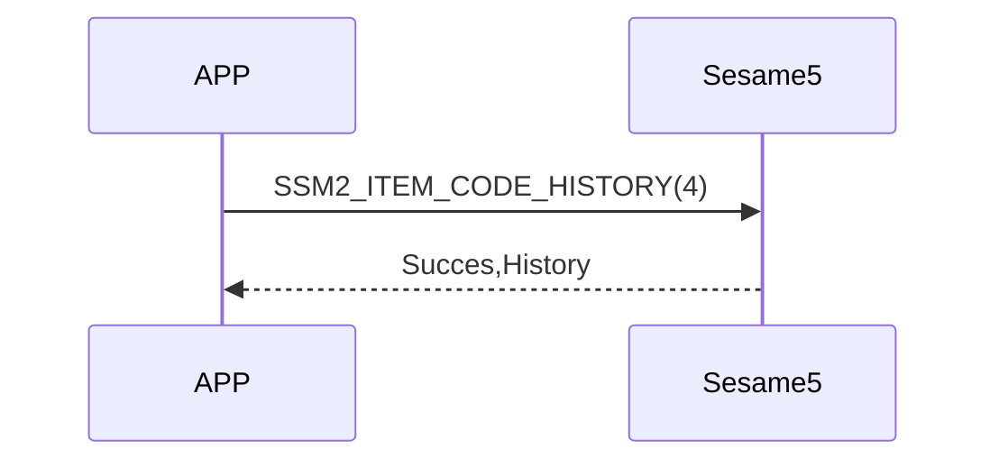

# 4 History (履歴)

スマートフォンから Sesame5 に履歴リクエストコマンドを送信すると、デバイスは Flash 内の **最も古い履歴を 1 件返します**。  
その履歴を削除する場合は、読み出した後に **削除コマンド** を送信する必要があります。  
（読み出しただけでは削除されません）

<!-- Sesame5 のブロードキャストには、履歴タグを読み取る必要があるかどうかのフラグが含まれています。詳細は advertising フィールドを参照してください。 -->

## シーケンス図



## スマートフォンからの送信データ

### 履歴の読み出し

| Byte |    1    |     0     |
| ---- | :-----: | :-------: |
| Data | 0x01 | item code |

item code : SSM2_ITEM_CODE_HISTORY (4)

`0x01` : 最も古い履歴を 1 件読み出す（削除はしない）

### 履歴の削除

読み出した履歴を削除する場合は、HISTORY_DELETE を送信します。

| Byte |  N ~ 0  |
| ---- | :-----: |
| Data | recordId |

item code : `SSM2_ITEM_CODE_HISTORY_DELETE`  
recordId : 読み出した際に取得した履歴の ID（4 バイト）


## ssm5 の返信内容

### 履歴が存在する場合

| Byte |     N ~ 3      |      2       |     1     |    0     |
| ---- | :------------: | :----------: | :-------: | :------: |
| Data |    payload     |     res      | item_code |   type   |
| 說明 | 履歴データ内容 | 結果 | コマンド番号  | プッシュタイプ |

type : SSM2_OP_CODE_RESPONSE (0x07)

item code : SSM2_ITEM_CODE_HISTORY(4)

res : CMD_RESULT_SUCCESS (0x00)


#### payload　構造

| Byte |     N ~ 16     |   15 ~ 9    |   8 ~ 5   |    4     |   3 ~ 0    |
| ---- | :------------: | :---------: | :-------: | :------: | :--------: |
| Data |     param      | mech_status |    ts     |   type   |     id     |
| 説明 | 履歴タグ・長さ |  機械状態   | タイムスタンプ | 履歴タイプ | レコード ID (4B) |

#### param

| Byte |  32 ~ 1  |      0      |
| ---- | :------: | :---------: |
| Data |   data   | data_length |
| 說明 | 履歴タグ |  タグの長さ   |


### 履歴が存在しない場合

| Byte |      2       |     1     |    0     |
| ---- | :----------: | :-------: | :------: |
| Data |     res      | item_code |   type   |
| 說明 | 結果 | コマンド番号  | プッシュタイプ |

type : SSM2_OP_CODE_RESPONSE (0x07)

item code : SSM2_ITEM_CODE_HISTORY(4)

res : CMD_RESULT_NOT_FOUND (0x05)


## データ構造 (C 定義)

```c

#pragma pack(1)
union ss5_his_param {
    int8_t data_length;
    int8_t data[32];
};
#pragma pack()

#pragma pack(1)
typedef struct {
    uint32_t id;                    /// 4 Bytes
    uint8_t type;                   /// 1 Bytes
    uint32_t ts;                    /// 4 Bytes
    mech_status_t mech_status;      /// 7 Bytes
    union ss5_his_param param;      /// 32 Bytes
} ssm_history;                      /// 4+1+4+7+32 = 48 Bytes
#pragma pack()

```

## iOS、Android、ESP32　の例
 

### Android の例

```kotlin
private fun readHistoryCommand() {
    if (isReadHistoryCommandRunning) {
        L.d("hcia", "[ss5][his][read] readHistoryCommand is already running")
        return
    }
    val isConnectNET = isInternetAvailable()
    sendCommand(SesameOS3Payload(SesameItemCode.history.value, byteArrayOf(0x01)), DeviceSegmentType.cipher) { res -> // 01: 从设备读取最旧的历史记录
        L.d("hcia", "[ss5][his][ResultCode]:" + res.cmdResultCode)
        val hisPaylaod = res.payload
        if (res.cmdResultCode == SesameResultCode.success.value) {
            // 改为 uuid 格式的 hisTag， APP不再兼容旧固件的历史记录， 若有客诉历史记录问题， 请升级锁的固件。
            if (isConnectNET && !isConnectedByWM2) {
                CHAccountManager.postSS5History(deviceId.toString().uppercase(), hisPaylaod.toHexString()) {
                    // 成功上传历史记录到云端后， 通过蓝牙删除这条历史记录， SS5固件会在它的Flash里删除掉这条历史记录。
                    val recordId = hisPaylaod.sliceArray(0..3)
                    it.onSuccess {
                        L.d("hcia", "[+]SSM2_ITEM_CODE_HISTORY_DELETE: ${recordId.toBigLong().toInt()}")
                        sendCommand(SesameOS3Payload(SesameItemCode.SSM2_ITEM_CODE_HISTORY_DELETE.value, recordId), DeviceSegmentType.cipher) { res ->
                            L.d("hcia", "[-]SSM2_ITEM_CODE_HISTORY_DELETE: ${res.cmdResultCode}")
                        }
                    }
                    it.onFailure { exception ->
                        L.d("hcia", "[ss5][history]postSS5History: $exception")
                    }
                }
            }
        }
        isReadHistoryCommandRunning = false
    }
}
```

### iOS の例

```swift
    func readHistoryCommand(_ result: @escaping (CHResult<CHEmpty>))  {
        L.d("[ss5][history] readHistoryCommand <=")
        URLSession.isInternetReachable { isInternetReachable in
//            L.d("[ss5][history] 連網?",isInternetReachable)
            self.sendCommand(.init( .history, "01".hexStringtoData())) { (result) in // 01: 从设备读取最旧的历史记录
                if result.cmdResultCode == .success {
                    guard isInternetReachable && !self.isConnectedByWM2 else { return }
                    self.postProcessHistory(result.data.copyData) { res in
                        if case .success(_) = res  {
                            let recordId = result.data.copyData[0...3].copyData
                            self.sendCommand(.init(SesameItemCode.historyDelete, recordId)) { response in
                                if response.cmdResultCode == .success  { L.d("[ss5][history]歷史删除成功") }
                            }
                        }
                    }
                } else {
                    (self.delegate as? CHSesame5Delegate)?.onHistoryReceived(device: self, result: .failure(self.errorFromResultCode(result.cmdResultCode)))
                    self.isHistory = false
                }
            }
        }
    }

```


### ESP の例

```c
// todo
```

