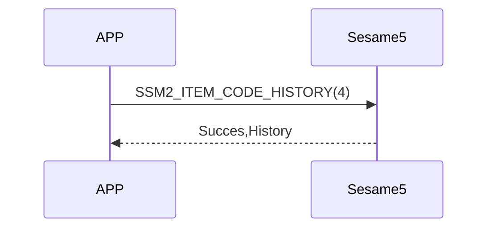

# 4 History (歷史)

手機向 Sesame5 發送歷史請求命令後，裝置會從 Flash 中回傳 **最舊的一筆歷史紀錄**。  
若需要刪除該筆歷史，必須在讀取後再發送 **刪除命令**。  
（僅仅读取不會刪除）

<!-- Sesame5 廣播中會帶有是否有歷史標籤需要讀出的旗標，詳見 advertising 欄位說明。 -->

## 循序圖



## 手機送出資料

### 讀取歷史

| Byte |    1    |     0     |
| ---- | :-----: | :-------: |
| Data | 0x01 | item code |

item code : SSM2_ITEM_CODE_HISTORY (4)

`0x01` : 讀取最舊的一筆歷史（不刪除）

### 刪除歷史

讀取後如需刪除該筆歷史，發送 `HISTORY_DELETE`：

| Byte |  N ~ 0  |
| ---- | :-----: |
| Data | recordId |

item code : `SSM2_ITEM_CODE_HISTORY_DELETE`  
recordId : 讀取時得到的歷史紀錄 ID（4 Bytes）


## ssm5 回傳內容

### 有歷史時

| Byte |     N ~ 3      |      2       |     1     |    0     |
| ---- | :------------: | :----------: | :-------: | :------: |
| Data |    payload     |     res      | item_code |   type   |
| 說明 | 歷史資料內容 | 結果 | 指令編號  | 推送類型 |

type : SSM2_OP_CODE_RESPONSE (0x07)

item code : SSM2_ITEM_CODE_HISTORY(4)

res : CMD_RESULT_SUCCESS (0x00)


#### payload　結構

| Byte |     N ~ 16     |   15 ~ 9    |   8 ~ 5   |    4     |   3 ~ 0    |
| ---- | :------------: | :---------: | :-------: | :------: | :--------: |
| Data |     param      | mech_status |    ts     |   type   |     id     |
| 說明 | 歷史標籤、長度 |  機械狀態   | timestamp | 歷史類型 | 紀錄 ID (4B) |

#### param

| Byte |  可變   |      1 ~ 0      |
| ---- | :------: | :---------: |
| Data |   Value   | tag |
| 說明 | UUID等 |  History Tag 類型   |


###  History Tag 類型 一覽

| Tag  | Value      | 說明            |
| :-----: | :---------------- | :-------------- |
| 0x0000  | NFC 卡            | 卡片開鎖        |
| 0x0001  | 指紋              | 指紋開鎖        |
| 0x0002  | 密碼              | 密碼開鎖        |
| 0x0003  | 人臉              | 人臉開鎖        |
| 0x0004  | 手掌              | 手掌開鎖        |
| 0x0005  | TouchPro 裝置 UUID | TouchPro 關鎖   |
| 0x0006  | Touch 裝置 UUID    | Touch 關鎖      |
| 0x0007  | Open Sensor 裝置 UUID | Open Sensor 關鎖 |
| 0x0008  | FacePro 裝置 UUID | FacePro 關鎖    |
| 0x0009  | Face 裝置 UUID    | Face 關鎖       |
| 0x000A  | Remote 裝置 UUID  | Remote 開/關鎖  |
| 0x000B  | Remote nano 裝置 UUID | Remote nano 開/關鎖 |
| 0x000C  | Biz 使用者 UUID   | Biz 開/關鎖     |
| 0x000D  | Web API 使用者 UUID | Web API 開/關鎖 |
| 0x000E  | Android 使用者 BLE UUID | Android BLE 開/關鎖 |
| 0x000F  | iOS 使用者 BLE UUID     | iOS BLE 開/關鎖 |
| 0x0010  | Android 使用者 Wi-Fi UUID | Android IoT 開/關鎖 |
| 0x0011  | iOS 使用者 Wi-Fi UUID     | iOS IoT 開/關鎖 |


### 沒有歷史時

| Byte |      2       |     1     |    0     |
| ---- | :----------: | :-------: | :------: |
| Data |     res      | item_code |   type   |
| 說明 | 結果 | 指令編號  | 推送類型 |

type : SSM2_OP_CODE_RESPONSE (0x07)

item code : SSM2_ITEM_CODE_HISTORY(4)

res : CMD_RESULT_NOT_FOUND (0x05)


## 資料結構 (C 定義)

```c

#pragma pack(1)
union ss5_his_param {
    int8_t data_length;
    int8_t data[32];
};
#pragma pack()

#pragma pack(1)
typedef struct {
    uint32_t id;                    /// 4 Bytes
    uint8_t type;                   /// 1 Bytes
    uint32_t ts;                    /// 4 Bytes
    mech_status_t mech_status;      /// 7 Bytes
    union ss5_his_param param;      /// 32 Bytes
} ssm_history;                      /// 4+1+4+7+32 = 48 Bytes
#pragma pack()

```

## iOS、Android、ESP32 範例
 

### Android 範例

```kotlin
private fun readHistoryCommand() {
    if (isReadHistoryCommandRunning) {
        L.d("hcia", "[ss5][his][read] readHistoryCommand is already running")
        return
    }
    val isConnectNET = isInternetAvailable()
    sendCommand(SesameOS3Payload(SesameItemCode.history.value, byteArrayOf(0x01)), DeviceSegmentType.cipher) { res -> // 01: 从设备读取最旧的历史记录
        L.d("hcia", "[ss5][his][ResultCode]:" + res.cmdResultCode)
        val hisPaylaod = res.payload
        if (res.cmdResultCode == SesameResultCode.success.value) {
            // 改为 uuid 格式的 hisTag， APP不再兼容旧固件的历史记录， 若有客诉历史记录问题， 请升级锁的固件。
            if (isConnectNET && !isConnectedByWM2) {
                CHAccountManager.postSS5History(deviceId.toString().uppercase(), hisPaylaod.toHexString()) {
                    // 成功上传历史记录到云端后， 通过蓝牙删除这条历史记录， SS5固件会在它的Flash里删除掉这条历史记录。
                    val recordId = hisPaylaod.sliceArray(0..3)
                    it.onSuccess {
                        L.d("hcia", "[+]SSM2_ITEM_CODE_HISTORY_DELETE: ${recordId.toBigLong().toInt()}")
                        sendCommand(SesameOS3Payload(SesameItemCode.SSM2_ITEM_CODE_HISTORY_DELETE.value, recordId), DeviceSegmentType.cipher) { res ->
                            L.d("hcia", "[-]SSM2_ITEM_CODE_HISTORY_DELETE: ${res.cmdResultCode}")
                        }
                    }
                    it.onFailure { exception ->
                        L.d("hcia", "[ss5][history]postSS5History: $exception")
                    }
                }
            }
        }
        isReadHistoryCommandRunning = false
    }
}
```

### iOS 範例

```swift
    func readHistoryCommand(_ result: @escaping (CHResult<CHEmpty>))  {
        L.d("[ss5][history] readHistoryCommand <=")
        URLSession.isInternetReachable { isInternetReachable in
//            L.d("[ss5][history] 連網?",isInternetReachable)
            self.sendCommand(.init( .history, "01".hexStringtoData())) { (result) in // 01: 从设备读取最旧的历史记录
                if result.cmdResultCode == .success {
                    guard isInternetReachable && !self.isConnectedByWM2 else { return }
                    self.postProcessHistory(result.data.copyData) { res in
                        if case .success(_) = res  {
                            let recordId = result.data.copyData[0...3].copyData
                            self.sendCommand(.init(SesameItemCode.historyDelete, recordId)) { response in
                                if response.cmdResultCode == .success  { L.d("[ss5][history]歷史删除成功") }
                            }
                        }
                    }
                } else {
                    (self.delegate as? CHSesame5Delegate)?.onHistoryReceived(device: self, result: .failure(self.errorFromResultCode(result.cmdResultCode)))
                    self.isHistory = false
                }
            }
        }
    }

```


### ESP 範例

```c
// todo
```

